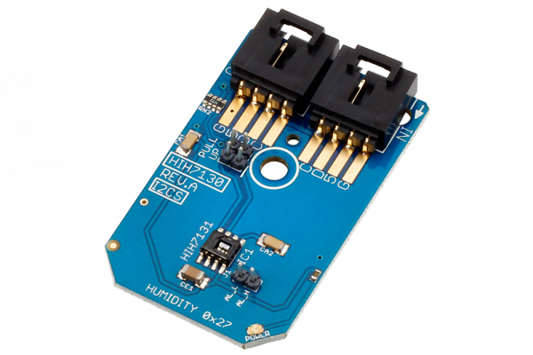

# HIH7130

Honeywell HumidIcon Digital Humidity/Temperature Sensors are digital output-type relative humidity and temperature sensors combined in the same package.These sensors provide an accuracy level of ±3% RH. They possess industry-leading long-term stability and reliability, true temperature-compensated digital I2C, energy efficiency, and ultra-small package size and options.
This Device is available from www.ncd.io 

[SKU: HIH7130_I2CS]

(https://store.ncd.io/product/hih7130-humidity-and-temperature-sensor-%C2%B13-rh-%C2%B11-0c-i2c-mini-module/)
This Sample code can be used with Arduino.

Hardware needed to interface HIH7130 sensor with Arduino

1. <a href="https://store.ncd.io/product/i2c-shield-for-arduino-nano/">Arduino Nano</a>

2. <a href="https://store.ncd.io/product/i2c-shield-for-arduino-micro-with-i2c-expansion-port/">Arduino Micro</a>

3. <a href="https://store.ncd.io/product/i2c-shield-for-arduino-uno/">Arduino uno</a>

4. <a href="https://store.ncd.io/product/dual-i2c-shield-for-arduino-due-with-modular-communications-interface/">Arduino Due</a>

5. <a href="https://store.ncd.io/product/hih7130-humidity-and-temperature-sensor-%C2%B13-rh-%C2%B11-0c-i2c-mini-module/">HIH7130 Humidity and Temperature Sensor</a>

6. <a href="https://store.ncd.io/product/i%C2%B2c-cable/">I2C Cable</a>

HIH7130:

Honeywell HumidIcon Digital Humidity/Temperature Sensors are digital output-type relative humidity and temperature sensors combined in the same package.These sensors provide an accuracy level of ±3% RH. They possess industry-leading long-term stability and reliability, true temperature-compensated digital I2C, energy efficiency, and ultra-small package size and options.

Applications:

• HVAC

• Weather stations

• Air compresser

• Respiratory therapy

• Indusrial incubators/microenvironments

How to Use the HIH7130 Arduino Library
The HIH7130 is very easy to interface as following.

1.Address calling:The following command is used to call the address of HIH7130 to start the transmission.

            hih.getAddr_HIH7130(HIH7130_DEFAULT_ADDRESS);   // 0x27

2.Temperature measurement:The following command is used to measure the temperature in celcius.

             cTemp = hih.Measure_Temperature();
            
3.Humidity measurement:The following command is used to measure the humidity in %RH.

             humidity = hih.Measure_Humidity();

